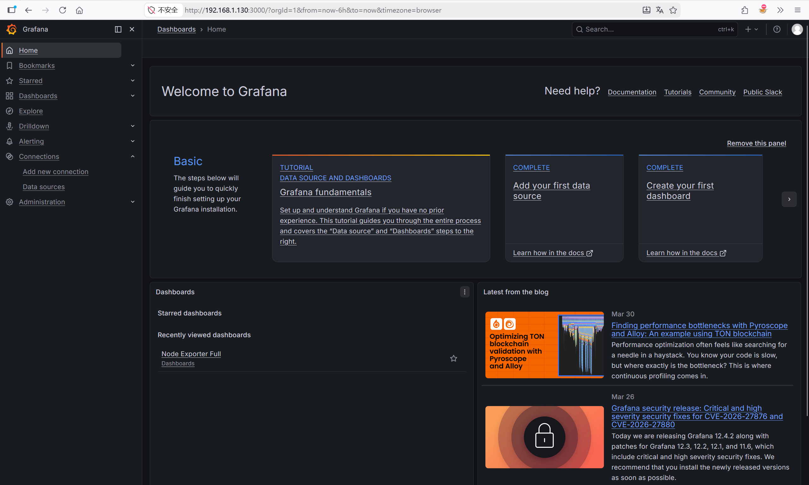
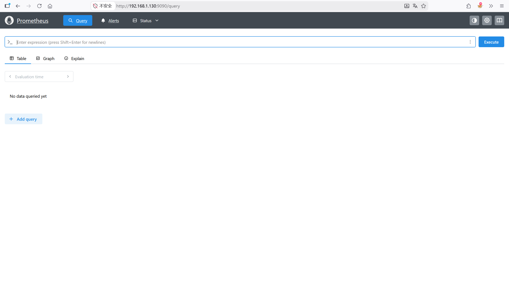
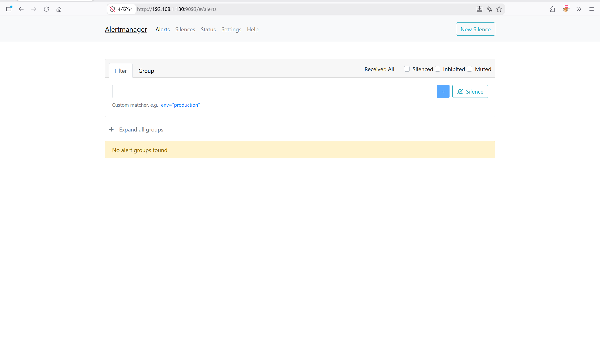
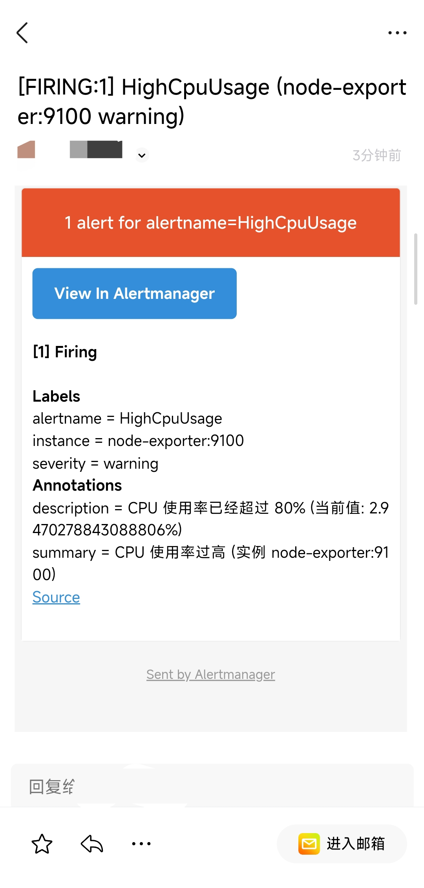

# Monitor Stack

本项目是一个基于 Docker Compose 构建的轻量级、全链路监控技术栈。它集成了 Prometheus、Grafana 和 Alertmanager，并预装了一系列现代化的 Grafana 应用插件，旨在提供强大的指标收集、可视化探索、分布式追踪分析以及告警管理能力。

## 📚 技术组件

- **Prometheus**: 负责指标数据的抓取、存储和查询。
- **Grafana**: 用于数据可视化和仪表盘展示。
- **Alertmanager**: 处理由 Prometheus 发出的告警，进行去重、分组并路由到通知渠道。
- **Docker Compose**: 用于编排和启动所有服务。

## 📂 项目结构

```text
.
├── alertmanager/
│   └── alertmanager.yml      # Alertmanager 配置文件，定义告警路由和接收器
├── grafana-data/
│   └── plugins/              # 预安装的 Grafana 插件目录
│       ├── grafana-exploretraces-app/       # 分布式追踪探索应用
│       ├── grafana-lokiexplore-app/         # Loki 日志探索应用
│       ├── grafana-metricsdrilldown-app/    # 指标下钻分析应用
│       └── grafana-pyroscope-app/           # Pyroscope 性能剖析应用
├── prometheus/
│   └── prometheus.yml        # Prometheus 主配置文件，定义 scrape targets 和规则
├── docker-compose.yml        # Docker Compose 编排文件
└── README.md                 # 项目说明文档
```
## 🚀 快速启动
1. 克隆项目
```bash
git clone <repository-url>
cd monitor-stack
```
2. 启动服务 使用 Docker Compose 启动所有监控组件：
```bash
docker-compose up -d
```
3. 访问 Grafana
- Grafana: http://localhost:3000
    - 默认用户名: admin
    - 默认密码: admin (首次登录需修改)
- Prometheus: http://localhost:9090
- Alertmanager: http://localhost:9093
示例展示：



引起CPU使用率过高报警后收到告警邮件:

## 🧩 预装 Grafana 插件说明
本项目在 grafana-data/plugins 目录下预装了以下官方应用插件，无需手动安装即可在 Grafana 中使用：

1. Traces Drilldown (grafana-exploretraces-app)
    - 功能: 分布式追踪探索应用。
    - 用途: 自动可视化 Tempo 追踪数据，通过 RED (Rate, Errors, Duration) 指标快速定位性能瓶颈和错误根源，无需编写复杂的 TraceQL 查询。
2. Logs Drilldown (grafana-lokiexplore-app)
    - 功能: Loki 日志探索应用。
    - 用途: 提供对 Loki 日志数据的交互式探索，支持通过标签和字段快速过滤、聚合和分析日志流，简化日志排查流程。
3. Metrics Drilldown (grafana-metricsdrilldown-app)
    - 功能: 指标下钻分析应用。
    - 用途: 智能浏览 Prometheus 指标，自动推荐相关图表和关联指标，帮助用户快速理解指标含义并发现异常模式。
4. Pyroscope App (grafana-pyroscope-app)
    - 功能: 连续性能剖析应用。
    - 用途: 集成 Pyroscope 数据源，提供 CPU、内存等资源的火焰图可视化，帮助开发者深入分析应用性能热点和资源消耗。
## ⚙️ 配置说明
- Prometheus: 编辑 prometheus/prometheus.yml 添加新的 scrape targets 或记录规则。
- Alertmanager: 编辑 alertmanager/alertmanager.yml 配置告警通知渠道（如邮件、Slack、Webhook 等）。
- Grafana: 数据持久化存储在 grafana-data 目录中，插件已预装，如需新增插件可修改 docker-compose.yml 中的挂载配置或使用Grafana UI 安装。
## 🛑 停止服务
```bash
docker-compose down
```
若要清除数据（包括 Grafana 仪表盘配置和 Prometheus 数据），请执行：
```bash
docker-compose down -v
```